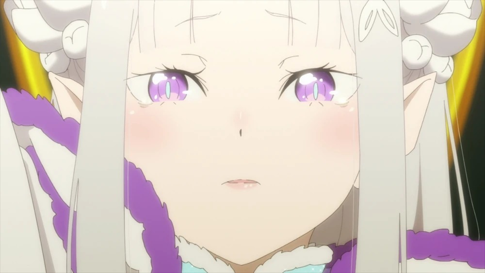

# ✨ Welcome to My Otaku Space! ✨

<div align="center">



### 🌸 Hey there, fellow anime lover! I'm Emiri! 🌸

> *"Life is like an anime - full of adventures, friendships, and magical moments!"* ✨

---

### 🎀 About Me 🎀

```
✧ Name: Emiri
✧ Pronouns: she/her
✧ Location: Anime World 🌍
✧ Favorite Season: Spring (sakura season! 🌸)
✧ Mood Today: ✨ Excited to code and watch anime! ✨
```

---

### 🌟 What I Love 🌟

#### 📺 Anime & Manga
- **Current Obsession:** Slice of life & magical girl anime
- **All-Time Favorites:** K-On!, Madoka Magica, Your Lie in April
- **Watching Status:** Always 10+ episodes behind 😅
- **Manga Collection:** Growing every month! 📚

#### 🎮 Gaming
- **Favorite Genres:** RPG, Visual Novels, Indie Games
- **Currently Playing:** Genshin Impact, Stardew Valley
- **Gaming Setup:** Cozy pastel theme 🎀
- **Play Style:** Completionist with extra steps ✨

#### 💻 Coding
- **Languages:** JavaScript, Python, TypeScript
- **Projects:** Anime tracking apps, gaming tools
- **Dream Project:** Create an anime recommendation AI! 🤖

---

### 🛠️ Tech Stack & Tools 🛠️

#### Languages & Frameworks
<p align="center">
  
  
  
  
  
</p>

#### Frontend Magic
<p align="center">
  
  
  
</p>

#### Backend & Tools
<p align="center">
  
  
  
  
</p>

---

### 📊 GitHub Stats 📊

<p align="center">
  
</p>

<p align="center">
  
</p>

<p align="center">
  
</p>

---

### 🎵 Currently Listening To 🎵

<p align="center">
  <i>🎶 Anime OSTs & J-Pop while coding! 🎶</i>
</p>

---

### 🌈 My Anime Watchlist 🌈

<table>
  <tr>
    <td align="center">
      <b>Currently Watching</b><br>
      🌸 Spring 2024 Anime<br>
      📺 12 episodes in progress
    </td>
    <td align="center">
      <b>Plan to Watch</b><br>
      📋 50+ anime saved<br>
      🎯 So much, so little time!
    </td>
    <td align="center">
      <b>Completed</b><br>
      ✅ 100+ anime finished<br>
      🏆 Proud otaku moment!
    </td>
  </tr>
</table>

---

### 🎮 Gaming Status 🎮

<div align="center">

| Game | Status | Hours | Rating |
|------|--------|-------|--------|
| Genshin Impact | 🎯 Active | 500+ | ⭐⭐⭐⭐⭐ |
| Stardew Valley | 🌱 Playing | 200+ | ⭐⭐⭐⭐⭐ |
| Zelda: TOTK | 🗡️ Completed | 150+ | ⭐⭐⭐⭐⭐ |
| Celeste | 🏔️ 100% | 80+ | ⭐⭐⭐⭐⭐ |

</div>

---

### 💌 Let's Connect! 💌

<div align="center">

[](https://github.com/emiriatang)
[](https://twitter.com/emiriatang)
[](https://discord.com)
[](https://myanimelist.net)

</div>

---

### ✨ Quote of the Day ✨

> *"The world is not beautiful, therefore it is."*  
> — Kino's Journey 🌍

---

### 🎀 Thanks for Visiting! 🎀

<div align="center">

**Made with 💖 and lots of 🍵 (green tea) & 🍡 (dango)**

*Come back soon for more anime discussions and coding adventures!*


---

**© 2024 Emiri | Crafted with ✨ otaku energy ✨**

</div>

---

<div align="center">

### 🌸 🌸 🌸 🌸 🌸 🌸 🌸 🌸 🌸 🌸 🌸 🌸 🌸

*Thank you for stopping by my little corner of the internet!*  
*May your code be bug-free and your anime always satisfying!* 🎌

### 🌸 🌸 🌸 🌸 🌸 🌸 🌸 🌸 🌸 🌸 🌸 🌸 🌸

</div>